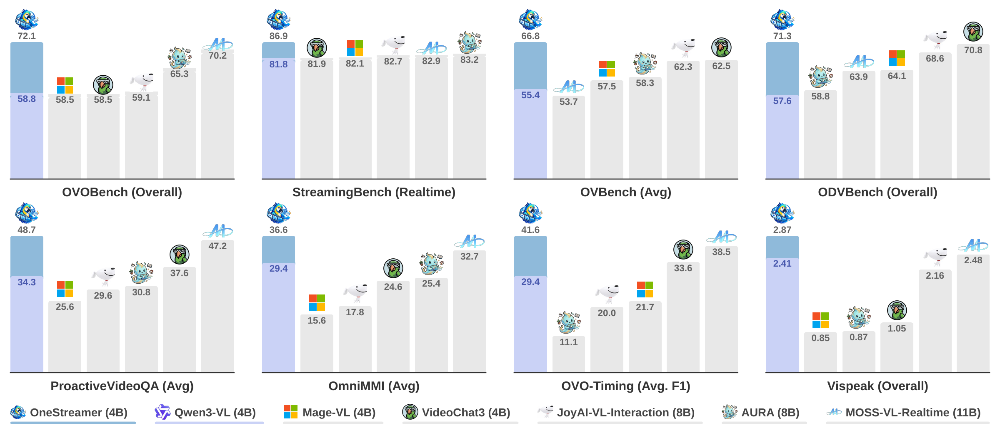
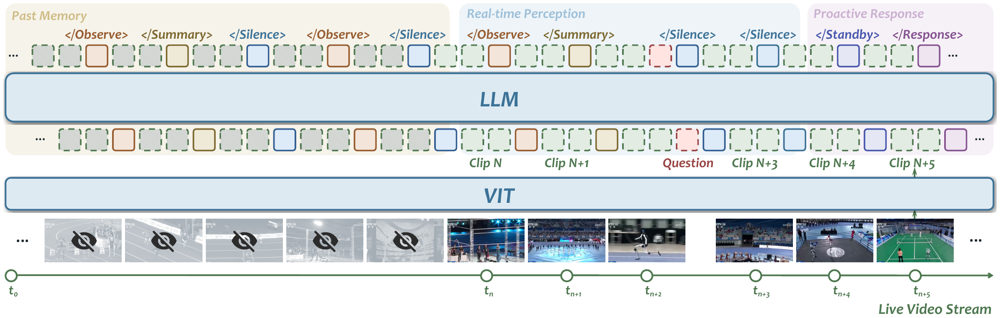
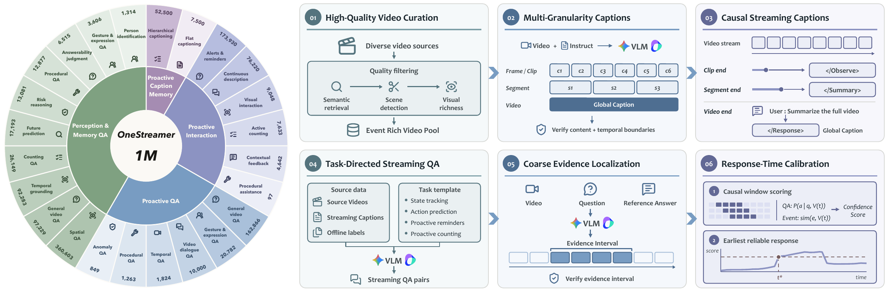
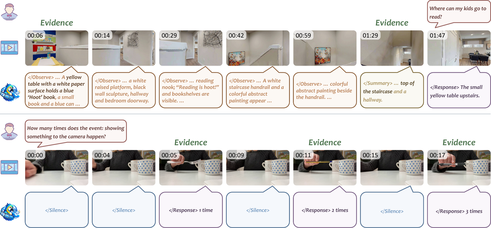

<p align="center">
  
</p>

<h1 align="center">OneStreamer</h1>
<h3 align="center">Unifying Perception, Memory, and Proactive Response<br>in Streaming Video Interaction</h3>

<p align="center">
  Xiangyu Zeng*, Yuandong Yang*, Zhiqiu Zhang*, Yuhan Zhu*, Xinhao Li*, Qingyi Si*<br>
  Changlian Ma, Yansong Shi, Haoran Chen, Xinyu Chen, Dingyu Yao, Junhao Zhou<br>
  Yifei Li, Jun Zhang, Chuanyu Qin, Chenxu Yang, Xinlei Yu, Kun Ouyang<br>
  Yuchen Shao, Changhai Zhou, Jun Gao, Jiaqi Wang, Limin Wang†
</p>

<p align="center">
  NJU · SHAILab · JD · SJTU · USTC · CAS · CUHK · PKU · THU · FDU · ZJU<br>
  <sub>* Equal contribution. † Corresponding author.</sub>
</p>

<p align="center">
  
  
  
  
  <a href="https://huggingface.co/MCG-NJU/OneStreamer-4B">
    
  </a>
  <a href="https://huggingface.co/datasets/MCG-NJU/OneStreamer-1M">
    
  </a>
  <a href="LICENSE">
    
  </a>
</p>

<p align="center">
  <a href="#overview">Overview</a> ·
  <a href="#method">Method</a> ·
  <a href="#models-and-data">Models and data</a> ·
  <a href="#results">Results</a> ·
  <a href="#quick-start">Quick start</a> ·
  <a href="#citation">Citation</a>
</p>

<p align="center"><strong>Perceive the present. Remember the past. Respond at the right time.</strong></p>

## Overview

**OneStreamer** is a streaming video LLM that jointly learns to record evidence and respond through a shared proactive generation process. It preserves time-grounded factual memory before future questions are known, interprets incoming visual evidence, and decides when enough evidence is available to respond.

Built on Qwen3-VL-4B-Instruct, **OneStreamer-4B** achieves the best aggregate results among the compared methods on all eight benchmarks in the paper, spanning online perception, memory, and proactive response.

<p align="center">
  
  <br><sub>Blue bars show OneStreamer; the lavender portions mark the Qwen3-VL baseline. Each panel uses its benchmark's metric.</sub>
</p>

- **Reusable memory:** Proactive Hierarchical Caption Memory (PHCM) retains local details and completed-event summaries alongside a recent visual window.
- **Timely responses:** Proactive State Transition Learning (PSTL) preserves output anchors and selects representative state changes and persistence, outperforming dense state supervision with only **27.5%** of annotated state tokens supervised.
- **Evidence-aligned training:** OneStreamer-1M combines streaming captions, streaming QA, and cleaned open-source data into **over one million** interaction records.

## Method

<p align="center">
  
</p>

**Proactive Hierarchical Caption Memory.** As video arrives, the model writes local-detail captions with `</Observe>` and summaries of completed events with `</Summary>`. These time-aligned records remain in text history after their source frames leave the recent visual window, supplying context for later questions without revisiting historical visual features. During training, causal caption targets also supervise the interpretation of observed video prefixes.

**Proactive State Transition Learning.** PSTL keeps supervision at every output anchor and selects representative tokens for state changes and state persistence. Other state tokens remain in the training sequence but are masked from the state loss; caption and answer text retain full supervision. At inference, the model directly generates control states and text from the available context.

For proactive QA, `</Silence>` means continued observation, `</Standby>` indicates emerging but insufficient evidence, and `</Response>` introduces a user-visible answer.

## Models and data

| Resource | Description | Availability |
| :--- | :--- | :--- |
| [OneStreamer-4B](https://huggingface.co/MCG-NJU/OneStreamer-4B) | 4B streaming video model initialized from Qwen3-VL-4B-Instruct | Public access pending |
| [OneStreamer-1M](https://huggingface.co/datasets/MCG-NJU/OneStreamer-1M) | Over one million records for streaming video interaction | Hugging Face dataset |

OneStreamer-1M covers proactive caption memory, perception and memory QA, proactive QA, and proactive interaction. Its synthesis pipeline aligns both the content and release time of each target with the evidence observed so far.

<p align="center">
  
</p>

The **caption branch** curates videos, verifies captions at multiple temporal scales, and releases each caption after its supporting evidence is observed. The **QA branch** generates task-directed questions, verifies supporting intervals, and calibrates response times to the earliest point that satisfies the reliability criterion. Synthesized examples are combined with cleaned open-source data in a common streaming format.

## Results

Selected comparisons from the paper's main results table are shown below. All metrics are higher-is-better; evaluation settings are documented in the [evaluation guide](Eval/docs/evaluation_settings.md).

### Perception and memory

| Model | Size | OVOBench<br>Overall | StreamingBench<br>Real-Time | OVBench<br>Avg. | ODVBench<br>Overall |
| :--- | :---: | ---: | ---: | ---: | ---: |
| Qwen3-VL (base) | 4B | 58.8 | 81.8 | 55.4 | 57.6 |
| VideoChat3 | 4B | 58.5 | 81.9 | 62.5 | 70.8 |
| Mage-VL | 4B | 58.5 | 82.1 | 57.5 | 64.1 |
| JoyAI-VL-Interaction | 8B | 59.1 | 82.7 | 62.3 | 68.6 |
| AURA | 8B | 65.3 | 83.2 | 58.3 | 58.8 |
| MOSS-VL-Realtime | 11B | 70.2 | 82.9 | 53.7 | 63.9 |
| **OneStreamer-4B** | **4B** | **72.1** | **86.9** | **66.8** | **71.3** |

### Proactive response

| Model | Size | ProactiveVideoQA<br>Avg. | OmniMMI<br>Avg. | OVO-Timing<br>Avg. F1 | ViSpeak<br>Avg. |
| :--- | :---: | ---: | ---: | ---: | ---: |
| Qwen3-VL (base) | 4B | 34.3 | 29.4 | 29.4 | 2.41 |
| VideoChat3 | 4B | 37.6 | 24.6 | 33.6 | 1.05 |
| Mage-VL | 4B | 25.6 | 15.6 | 21.7 | 0.85 |
| JoyAI-VL-Interaction | 8B | 29.6 | 17.8 | 20.0 | 2.16 |
| AURA | 8B | 30.8 | 25.4 | 11.1 | 0.87 |
| MOSS-VL-Realtime | 11B | 47.2 | 32.7 | 38.5 | 2.48 |
| **OneStreamer-4B** | **4B** | **48.7** | **36.6** | **41.6** | **2.87** |

ProactiveVideoQA is abbreviated as ProactiveVQA in the paper. OneStreamer's OmniMMI result uses ASR for AP, SI, MD, and SG; PA uses visual input only. ViSpeak retains its native 0–5 score scale.

<details>
<summary><strong>Answer-stage efficiency</strong></summary>

Measurements on one 360-second OVOBench sample using a single NVIDIA H200. FIFO and PHCM use the same Recent-16 visual window; PHCM additionally uses precomputed caption memory. These measurements cover answering and exclude memory construction.

| Strategy | GPU memory (GB) ↓ | Context tokens ↓ | Time to first token (s) ↓ |
| :--- | ---: | ---: | ---: |
| Full visual history | 25.18 | 62,094 | 4.560 |
| FIFO | 9.69 | 3,036 | 0.094 |
| PHCM | 9.98 | 4,308 | 0.124 |

</details>

## Memory and proactive response in action

<p align="center">
  
  <br><sub>Top: caption records retain evidence for a later question. Bottom: the model updates its count when each target event occurs.</sub>
</p>

The [inference example](Inference/README.md) includes the counting video and runs the model on incoming frames, printing proactive responses as they are generated.

## Codebase

| Directory | Purpose | Guide | Entry point |
| :--- | :--- | :--- | :--- |
| `Inference/` | Run proactive inference on a video and user instruction | [Inference guide](Inference/README.md) | [`inference.py`](Inference/inference.py) |
| `Eval/` | Evaluate eight benchmarks, with separate inference and scoring | [Evaluation guide](Eval/README.md) | [`run_eval_8gpu.sh`](Eval/run_script/run_eval_8gpu.sh) |

## Quick start

### Prepare the environment and checkpoint

Follow [Evaluation / Preparation](Eval/README.md#preparation) to create the `onestreamer-eval` environment. The evaluated stack uses Python 3.10, PyTorch 2.6.0 with CUDA 12.4, Transformers 4.57.6, and FlashAttention-2. The guide includes the required installation order and exact dependency versions.

Place the OneStreamer-4B checkpoint under `path_to/models/OneStreamer-4B/` at the repository root, or pass `--model-path` to the inference script. For evaluation, set model paths in [`models.json`](Eval/run_script/configs/models.json). Commands below run from the repository root.

### Run proactive inference

```bash
conda activate onestreamer-eval
CUDA_VISIBLE_DEVICES=0 python Inference/inference.py
```

This runs the included video with the question: *“How many times does the event: showing something to the camera happen?”* Responses are printed immediately, and all updates are saved to `Inference/outputs/responses.jsonl`.

To use your own input:

```bash
CUDA_VISIBLE_DEVICES=0 python Inference/inference.py \
  --video ../path_to/videos/example.mp4 \
  --question "Tell me when the person picks up the cup." \
  --output outputs/my_video.jsonl
```

The inference script resolves relative paths from `Inference/`. See the [inference guide](Inference/README.md) for model-path overrides and additional options.

### Evaluate on eight benchmarks

Download **OVOBench, StreamingBench, OVBench, ODVBench, ProactiveVideoQA, OmniMMI, OVO-Timing, and ViSpeak**, then configure [`paths.json`](Eval/run_script/configs/paths.json) following the [data layout](Eval/docs/data_layout.md). OVO-Timing shares the OVOBench videos; the selected OmniMMI ASR caches are included.

```bash
# Run prediction jobs sequentially across eight GPUs.
bash Eval/run_script/run_eval_8gpu.sh \
  --model OneStreamer-4B --mode infer --run-id evaluation

# Score the saved predictions; configure text-judge credentials first.
bash Eval/run_script/run_eval_8gpu.sh \
  --model OneStreamer-4B --mode judge --run-id evaluation
```

Independent scoring uses saved annotations and predictions and needs no GPU, checkpoint, video, or ASR cache. Prediction outputs are grouped under `Eval/outputs/<model>/<bench>/`, and metrics and judge caches under `Eval/judge_outputs/<model>/<bench>/`. See the [evaluation guide](Eval/README.md) for individual benchmarks, resume, model switching, and judge configuration.

## License and acknowledgements

Project code is licensed under [Apache-2.0](LICENSE). Third-party components retain their original licenses; see [NOTICE](NOTICE). Dataset media and model checkpoints remain subject to their respective source terms.

We thank the authors of [Qwen3-VL](https://github.com/QwenLM/Qwen3-VL), [VLMEvalKit](https://github.com/open-compass/VLMEvalKit), and the benchmark and data resources used in this project. Figures in this README are taken from the OneStreamer paper; their sources are listed in [assets/README.md](assets/README.md).

## Citation


```bibtex
@misc{zeng2026onestreamer,
  title={OneStreamer: Unifying Perception, Memory, and Proactive Response in Streaming Video Interaction},
  author={Xiangyu Zeng and Yuandong Yang and Zhiqiu Zhang and Yuhan Zhu and Xinhao Li and Qingyi Si and Changlian Ma and Yansong Shi and Haoran Chen and Xinyu Chen and Dingyu Yao and Junhao Zhou and Yifei Li and Jun Zhang and Chuanyu Qin and Chenxu Yang and Xinlei Yu and Kun Ouyang and Yuchen Shao and Changhai Zhou and Jun Gao and Jiaqi Wang and Limin Wang},
  year={2026}
}
```
